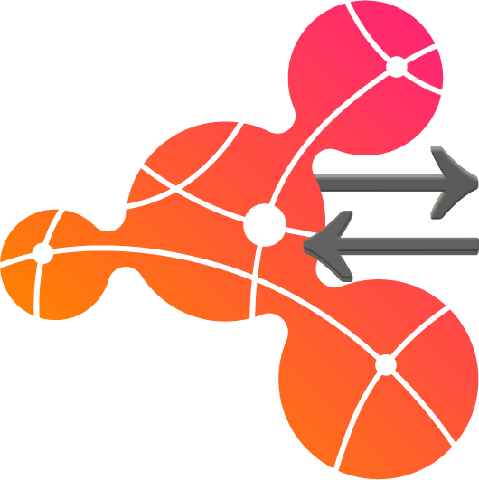
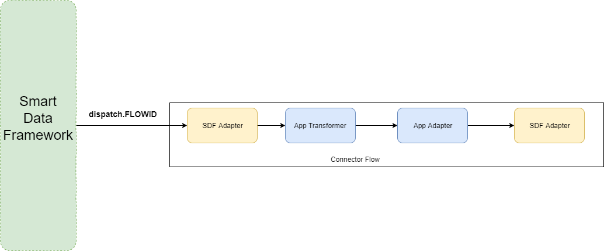
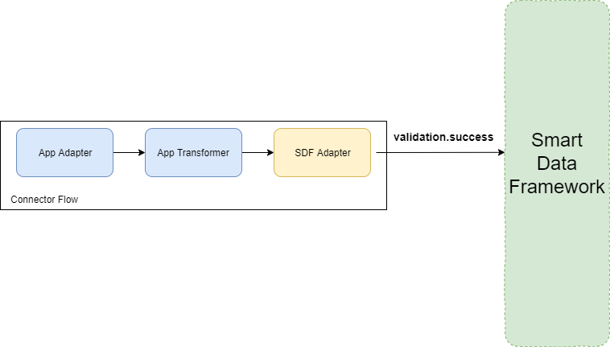
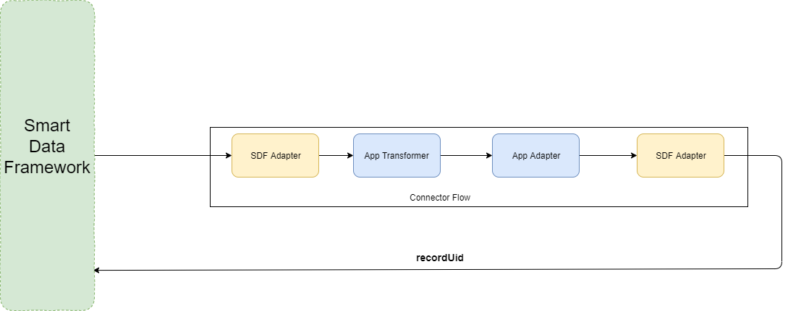

<p align="center">
  
</p>

# Smart Data Framework Adapter  



The Smart Data Framework Adapter (SDF-Adapter) allows flows to communicate with the smart data framework. It is responsible for forwarding the incoming events to the smart data framework. Furthermore, it is responsbile for increasing the ease of use for connector developers as it masks service endpoints.

- [Smart Data Framework Adapter](#smart-data-framework-adapter)
- [Trigger](#trigger)
  - [Entrypoint Trigger](#entrypoint-trigger)
  - [Receive Events](#receive-events)
- [Actions](#actions)
  - [Entrypoint Action](#entrypoint-action)
  - [Message Processing](#message-processing)
    - [Send Message to Open Integration Hub](#send-message-to-open-integration-hub)
    - [Send recordUid to Open Integration Hub](#send-recorduid-to-open-integration-hub)

# Trigger

## Entrypoint Trigger

The SDF-Adpater is triggered by incoming events received from either the Open Integration Hub i.e. Smart Data Framework.

## Receive Events

If the Smart Data Frameworks starts a flow with the SDF Adapter as the first component, the trigger receiveEvents should be configured as `function`.
The SDF Adapter subscribes to events having `dispatch.FLOWID` as their topic, where FLOWID is the id of the current flow.
Once the SDF Adapter receives a message it passes it onto the queue for further processing by the subsequent component. In this case the application (and master data model) specific transformer.



# Actions

## Entrypoint Action

The SDF-Adpater is triggered by incoming events received from either the preceding adapter or the transformer (depending on oih operator configuration).

## Message Processing

### Send Message to Open Integration Hub

If a message arrives from the preceding component it is forwared to the correct service(s)/queue(s). The message is then consumed by the data hub for further processing.



The following snippet shows an example of a dataset that has been processed by the sdf adapter:

```json
{
    "meta":{
        "domainId":"123",
        "schemaUri":"/collaboration/task.json",
        "recordUid":"456",
        "applicationUid":"ab1",
        "iamToken":"ddfdsfsdf5-sdfsdfsdfsdf6",
    },
    "data":{
        "title": "Prof.",
        "salutation": "Mr.",
        "firstName": "John",
        "middleName": "Anthony",
        "lastName": "Doe",
        "gender": "male",
        "birthday": "Wed, 14 Jun 1999 07:00:00 GMT",
        "notes": "Private notes",
        "displayName": "johndoe",
        "language": "english",
        "nickname": "johny",
        "jobTitle": "Sales manager",
        "photo": "http://example.org/photo.jpg",
        "anniversary": "14 Jun",
        "addresses": [
        {
            "street": "Hohestr",
            "streetNumber": "3",
            "unit": "a",
            "zipCode": "50667",
            "city": "Cologne",
            "district": "Alstadt-Sued",
            "region": "NRW",
            "country": "Germany",
            "primaryContact": "Hermann Schmitz",
            "description": "primary"
        },
        {
            "street": "Rudolfplatz",
            "streetNumber": "3",
            "unit": "a",
            "zipCode": "50667",
            "city": "Cologne",
            "district": "Alstadt-Sued",
            "region": "NRW",
            "country": "Germany",
            "primaryContact": "Hermann Schmitz",
            "description": "mailing"
        }
        ],
        "contactData": [
        {
            "value": "123456789",
            "type": "phone",
            "description": "primary"
        },
        {
            "value": "00224477",
            "type": "phone",
            "description": "private"
        },
        {
            "value": "95248793",
            "type": "phone",
            "description": "mobile"
        },
        {
            "value": "jon@doe.com",
            "type": "email",
            "description": "private"
        },
        {
            "value": "xing.de/yourUsername",
            "type": "xing",
            "description": "xing"
        },
        {
            "value": "98326307",
            "type": "phone",
            "description": "secondary"
        }
        ],
        "calendar": [
        {
            "calendar": "http://example.org/kalender/emuster",
            "busyCalendar": "http://example.org/kalender/emuster/busy",
            "requestCalendar": "http://example.org/kalender/emuster/appointment",
            "description": "private"
        }
        ],
        "category": [
        {
            "name": "private",
            "description": "private address data of the person"
        }
        ]
    }
}
```

### Send recordUid to Open Integration Hub

The SDF Adapter also takes care of sending the recordUid generated by the preceding to the SDF for ID Linking.
In order to properly link the recordUid generated by the target application to the correct oih data record SDF Adapter also send the encrypted oihuid as well as the applicationId to the SDF.

The figure below illustrates an end to end process:



The following snippet shows the structure of the object that is emitted by this function:

```json
{
    "meta": {
      "oihUid": "abc",
      "applicationUid": "Its easy as",
      "recordUid": "123",
    },
    "data":{
        "emptyPayload"
    }
}
```
